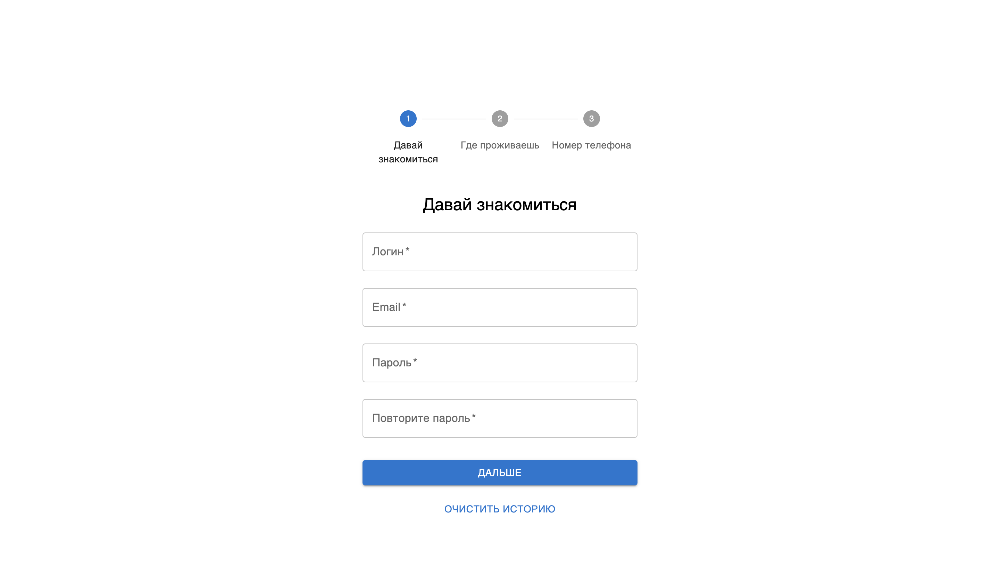
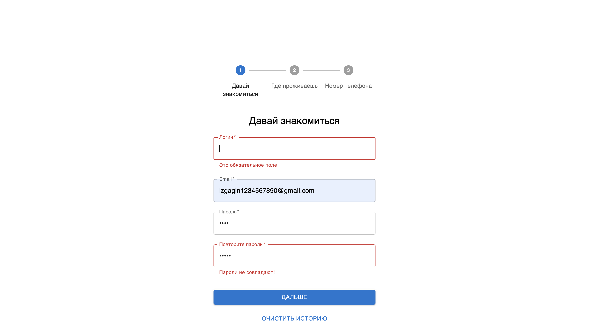
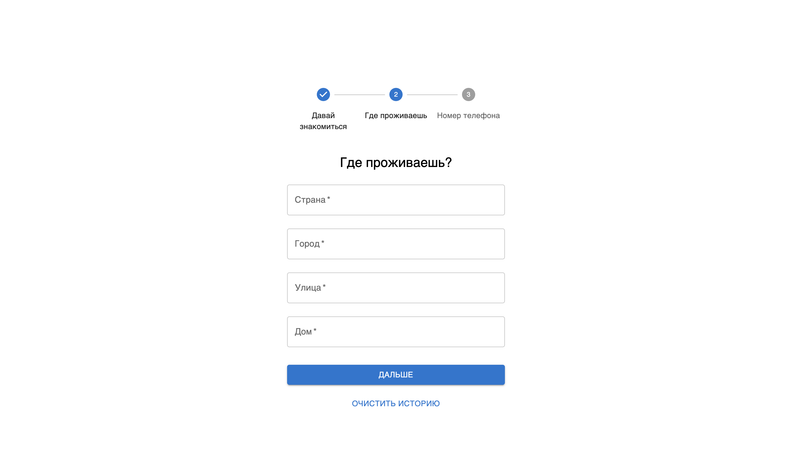
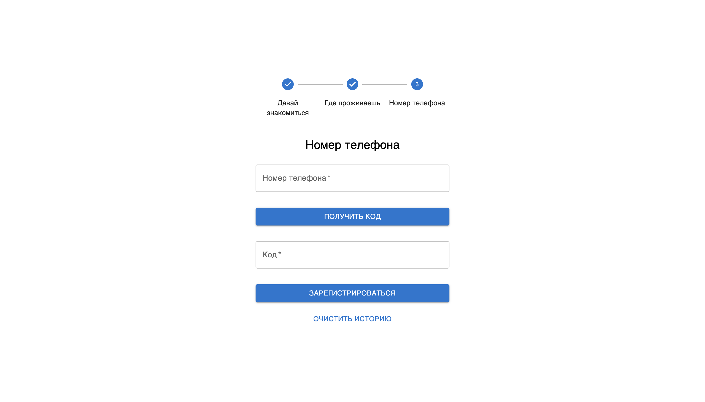
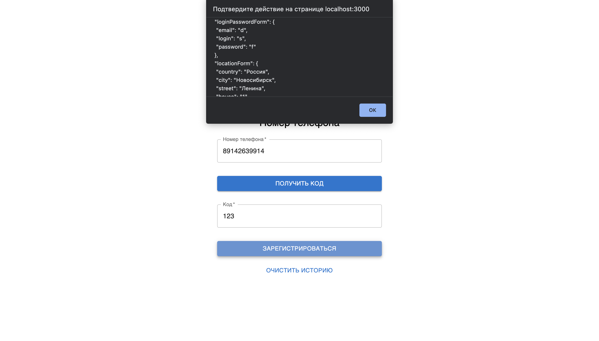

# Тестовое задание на вакансию frontend разработчика

### Версия node: v16.13.1
## Чтобы запустить проект нужно:
1) `git clone` репозитория
2) `npm install` для установки всех пакетов
3) `npm start` для запуска приложения
## Cтек:
1) React: 18.2.0
2) Redux: 4.2.0
3) React-redux: 8.0.4
4) MUI: 5.10.10
5) React-hook-form: 7.38.0

#### Приложение представляет собой приложение - поэтапную форму регистрации
#### Приложение сделано так, что можно удобно добавлять и менять местами этапы форм
#### Все написано универсально, чтобы при добавлении новых этапов нужно было дописать меньшее количество строк кода
#### Все данные, заполненные пользователем сохраняются в localstorage, откуда потом берутся, что делает удобным сохранять прогресс пользователя после перезагрузки

#### Некоторые поля обязательны, также есть проверка на правильность пароля

#### После последнего этапа, происходит отправка формы, в данном случае выводится алерт с формой
